**ÍNDICE**
[[DOCS - API ERP(MRP-I, MRP-II)#1. Introdução|1. Introdução]]
[[DOCS - API ERP(MRP-I, MRP-II)#2. Arquitetura do Sistema|2. Arquitetura do Sistema]]
- [[DOCS - API ERP(MRP-I, MRP-II)#2.1 Interface de Software|2.1 Interface de Software]]

[[DOCS - API ERP(MRP-I, MRP-II)#3. Endpoints|3. Endpoints]]
- [[DOCS - API ERP(MRP-I, MRP-II)#3.1 Funcionarios|3.1 Funcionarios]]
- [[DOCS - API ERP(MRP-I, MRP-II)#3.2 EstoqueInsumo|3.2 EstoqueInsumo]]
- [[DOCS - API ERP(MRP-I, MRP-II)#3.3 EstoqueProduto|3.3 EstoqueProduto]]
- [[DOCS - API ERP(MRP-I, MRP-II)#3.4 EntradaInsumo|3.4 EntradaInsumo]]
- [[DOCS - API ERP(MRP-I, MRP-II)#3.5 SaidaProduto|3.5 SaidaProduto]]
- [[DOCS - API ERP(MRP-I, MRP-II)#3.6 SaidaInsumo|3.6 SaidaInsumo]]
- [[DOCS - API ERP(MRP-I, MRP-II)#3.7 Maquinas|3.7 Maquinas]]
- [[DOCS - API ERP(MRP-I, MRP-II)#3.8 CalculoProducao|3.8 CalculoProducao]]
- [[DOCS - API ERP(MRP-I, MRP-II)#3.9 Insumos|3.9 Insumos]]
- [[DOCS - API ERP(MRP-I, MRP-II)#3.10 Produtos|3.10 Produtos]]
- [[DOCS - API ERP(MRP-I, MRP-II)#3.11 Usuarios|3.11 Usuarios]]

[[DOCS - API ERP(MRP-I, MRP-II)#==4. Models e Repositórios== to-do|4. Models e Repositórios]]
- [[DOCS - API ERP(MRP-I, MRP-II)#4.1 Models|4.1 Models]]
- [[DOCS - API ERP(MRP-I, MRP-II)#4.2 Repositórios|4.2 Repositórios]]

[[DOCS - API ERP(MRP-I, MRP-II)#==5. Diagramas== to-do|5 Diagramas]]
- [[DOCS - API ERP(MRP-I, MRP-II)#5.1 Sequência|5.2 Sequência]]

	- [[DOCS - API ERP(MRP-I, MRP-II)#5.1.1 Por Requisito Funcional (MRP-I)|5.1.1 Por Requisito Funcional (MRP-I)]]
	- [[DOCS - API ERP(MRP-I, MRP-II)#5.1.2 Por Requisito Funcional (MRP-II)|5.1.2 Por Requisito Funcional (MRP-II)]]

- [[DOCS - API ERP(MRP-I, MRP-II)#5.2 Caso de Uso|5.2 Caso de Uso]]
	- [[DOCS - API ERP(MRP-I, MRP-II)#5.2.1 Por Requisito Funcional (MRP-I)|5.2.1 Por Requisito Funcional (MRP-I)]]
	- [[DOCS - API ERP(MRP-I, MRP-II)#5.2.2 Por Requisito Funcional (MRP-II)|5.2.2 Por Requisito Funcional (MRP-I)]]


───────── ❖ ─────────

**TO-DO's** #to-do
↪ Realizar documentação dentro do código p/ melhor esclarecimento nas Models e Repositórios (Item 4)

---
---
# 1. Introdução
O documento descreve a estrutura, funcionamento e padronização no backend para o sistema ERP(MRP-I | MRP-II), auxiliando o gerenciamento e produção para uma indústria têxtil, focada em vestimentas.

---
# 2. Arquitetura do Sistema
O backend irá utilizar a linguagem de programação **C# .NET** com uma abordagem **RESTful** para endpoints. Haverá **controllers distintas** entre MRP's, onde terá uma comunicação direta entre as mesmas.

**Informações estruturais**
- **Variáveis:** camelCase
- **Classes e Métodos:** PascalCase
- **Servidor:** Externo
- **Local de teste:** Swagger

## 2.1 Interface de Software
A interface entre os sistemas MRP I e MRP II segue os seguintes princípios:

- **Comunicação via HTTP RESTful**, sem autenticação implementada até o momento.
- **MRP II realiza chamadas para o MRP I** para acessar cálculos ou dados necessários. Ou seja, o MRP II funciona como uma extensão do MRP I, englobando e integrando os cálculos de ambos.
- Ambos compartilham **o mesmo banco de dados físico**, mas utilizam **tabelas distintas** para manter a organização e o isolamento lógico entre os domínios.
	⭢ **Exemplo:** existe uma tabela de máquinas utilizada apenas pelo MRP II.
- As chamadas entre os sistemas são feitas por meio de requisições HTTP internas, considerando que ambos estão hospedados em um mesmo ambiente controlado.

Essa abordagem garante uma integração modular e escalável, permitindo que os módulos MRP evoluam separadamente, mas ainda mantendo a coesão necessária entre as operações de planejamento e produção.

---
# 3. Endpoints
## 3.1 Funcionarios
```
GET https://localhost:porta/api/MRP1/Operadores
POST https://localhost:porta/api/MRP1/Operadores

	"ID" : 0,
	"Nome" : "String",
	"Matricula" : "String",
	"Maquina" : 0,
	"Cargo" : "String",
	"Hierarquia" : 0,
	"Setor" : "String",
	"Status" : 0
```

## 3.2 EstoqueInsumo
```
GET https://localhost:porta/api/MRP1/EstoqueMaterial
POST https://localhost:porta/api/MRP1/Operadores

	"ID" : 0,
	"Nome" : "String",
	"Tipo" : "String",
	"Codigo" : "String",
	"Fornecedor" : "String",
	"Qntd" : "String"
```

## 3.3 EstoqueProduto
```
GET https://localhost:porta/api/MRP1/EstoqueProduto
GET https://localhost:porta/api/MRP1/EstoqueProduto/{id}
POST https://localhost:porta/api/MRP1/EstoqueProduto

	"ID" : 0,
	"Nome" : "String",
	"Tipo": "String",
	"Codigo" : "String",
	"Operador" : 0,
	"Maquina" : 0,
	"Qntd" : 0
```

## 3.4 EntradaInsumo
```
GET https://localhost:porta/api/MRP1/LogEntrada
POST https://localhost:porta/api/MRP1/LogEntrada

	"ID" : 0,
	"Nome" : "String",
	"Tipo" : "String",
	"Codigo" : "String",
	"Transportadora" : "String",
	"Fornecedor" : "String",
	"DataEntrada" : data
```

## 3.5 SaidaProduto
```
GET https://localhost:porta/api/MRP1/LogSaida
POST https://localhost:porta/api/MRP1/LogSaida

	"ID" : 0,
	"Nome" : "String",
	"Tipo" : "String",
	"Codigo" : "String",
	"Transportadora" : "String",
	"DataSaida" : data
```

## 3.6 SaidaInsumo
```
GET https://localhost:porta/api/MRP1/LogSaida
POST https://localhost:porta/api/MRP1/LogSaida

	"ID" : 0,
	"Nome" : "String",
	"Tipo" : "String",
	"Codigo" : "String",
	"Transportadora" : "String",
	"Setor" : "String",
	"DataSaida" : data
```

## 3.7 Maquinas
```
GET https://localhost:porta/api/MRP2/Machines
POST https://localhost:porta/api/MRP2/Machines
GET https://localhost:porta/api/MRP2/Machines/{id}
DELETE https://localhost:porta/api/MRP2/Machines/delete/{id}
PUT https://localhost:porta/api/MRP2/Machines/define/{id}

	"ID" : 0,
	"Modelo" : "String",
	"Status" : "String",
	"Operador" : "String",
	"SerialNumber" : "String",
	"CPH" : "String"
```

## 3.8 CalculoProducao
```
GET https://localhost:porta/api/MRP2/Production/calcular

	"maquinaId": 1,
	"produtoId": 2,
	"qntdDesejada": 10

```

## 3.9 Insumos
```
GET https://localhost:porta/api/MRP2/Insumos
POST https://localhost:porta/api/MRP2/Insumos
GET https://localhost:porta/api/MRP2/Insumos/{id}
DELETE https://localhost:porta/api/MRP2/Insumos/delete/{id}

	"ID" : 0,
	"Nome" : "String",
	"Tipo" : "String",
	"Codigo" : "String",
	"Fornecedor" : "String",
	"Quantidade" : 0
```

## 3.10 Produtos
```
GET https://localhost:porta/api/MRP2/Products
POST https://localhost:porta/api/MRP2/Products
GET https://localhost:porta/api/MRP2/Products/{id}
DELETE https://localhost:porta/api/MRP2/Products/delete/{id}

	"ID" : 0,
	"Nome" : "String",
	"Tipo" : "String",
	"Codigo" : "String",
	"Quantidade" : 0
```

## 3.11 Usuarios
```
GET https://localhost:porta/api/User/usuarios
GET https://localhost:porta/api/User/usuarios/{id}
POST https://localhost:porta/api/User/register
POST https://localhost:porta/api/User/login

	"ID" : 0,
	"Nome" : "String",
	"Matricula" : "String",
	"Senha" : "String",
	"Cargo" : "String",
	"Hierarquia" : 0,
	"Setor" : "String"
```

---
# ==4. Models e Repositórios== #to-do
Abaixo estão descritas as principais **models** utilizadas no sistema e os **repositórios** responsáveis por suas operações:

## 4.1 Models
### Usuario
```csharp
public class UserModel {
    public int Id { get; set; }
    public string Nome { get; set; }
    public string Matricula { get; set; }
    public string Senha { get; set; }
    public string Cargo { get; set; }
    public int Hierarquia { get; set; }
    public string Setor { get; set; }
    public int Maquina { get; set; }
    public UserStatus Status { get; set; }
}
```

### Insumos
```csharp
public class InsumosModel {
    public int Id { get; set; }
    public string Nome { get; set; }
    public string Tipo { get; set; }
    public string Codigo { get; set; }
    public int Qntd { get; set; }
    public float Custo { get; set; }
    public int Id_Fornecedor { get; set; }
}
```

### Maquinas
```csharp
public class MachinesModel {
    public int Id { get; set; }
    public string Modelo { get; set; }
    public MachinesStatus Status { get; set; }
    public int IdUser { get; set; }
    public UserModel? User { get; set; }
    public string SerialNumber { get; set; }
    public string CPH { get; set; }
}
```

### Produtos
```csharp
public class ProductsModel {
    public int Id { get; set; }
    public string Nome { get; set; }
    public string Tipo { get; set; }
    public string Codigo { get; set; }
    public int Id_Maquina { get; set; }
    public MachinesModel? MachinesID { get; set; }
    public int Id_Funcionario { get; set; }
    public UserModel? UserID { get; set; }
    public int Qntd { get; set; }
    public decimal Custo { get; set; }
}
```

### Validação de Login
```csharp
public class ValidationModel {
    public string Matricula { get; set; }
    public string Senha { get; set; }
}
```

## 4.2 Repositórios
### Usuario
```csharp
public class UserRepostorio : IUserRepostorio {
    private readonly UserDBContext _dbContext;

    public UserRepostorio(UserDBContext dbContext) {
        _dbContext = dbContext;
    }

    public async Task<UserModel> AddUser(UserModel user) {
        Console.WriteLine($"Adicionando usuário: {user.Nome}");
        await _dbContext.Users.AddAsync(user);
        await _dbContext.SaveChangesAsync();
        return user;
    }

    public async Task<List<UserModel>> GetAllUsers() {
        Console.WriteLine("Buscando todos os usuários");
        return await _dbContext.Users.ToListAsync();
    }

    public Task<UserModel> GetUser(int id) {
        Console.WriteLine($"Buscando usuário com ID: {id}");
        return _dbContext.Users.FirstOrDefaultAsync(x => x.Id == id);
    }

    public async Task<UserModel> AuthenticUser(ValidationModel login) {
        Console.WriteLine($"Autenticando usuário com matrícula: {login.Matricula}");
        var usuario = await _dbContext.Users.FirstOrDefaultAsync(u => u.Matricula == login.Matricula);

        if (usuario == null || usuario.Senha != login.Senha) {
            throw new Exception("Usuário ou Senha incorretos");
        }

        return usuario;
    }
}
```

### Insumos
```csharp
public class InsumosRepositorio : IInsumosRepositorio {
    private readonly AppDbContext _context;

    public InsumosRepositorio(AppDbContext context) {
        _context = context;
    }

    public async Task<List<InsumosModel>> GetAll() {
        return await _context.Insumos.ToListAsync();
    }

    public async Task<InsumosModel> GetById(int id) {
        return await _context.Insumos.FirstOrDefaultAsync(x => x.Id == id);
    }

    public async Task<InsumosModel> Create(InsumosModel insumo) {
        _context.Insumos.Add(insumo);
        await _context.SaveChangesAsync();
        return insumo;
    }

    public async Task<bool> Delete(int id) {
        var insumo = await _context.Insumos.FirstOrDefaultAsync(x => x.Id == id);
        if (insumo == null) return false;

        _context.Insumos.Remove(insumo);
        await _context.SaveChangesAsync();
        return true;
    }
}
```

### Maquinas
```csharp
public class MachinesRepositorio : IMachinesRepositorio {
    private readonly AppDbContext _context;

    public MachinesRepositorio(AppDbContext context) {
        _context = context;
    }

    public async Task<List<MachinesModel>> GetAll() {
        return await _context.Machines.Include(m => m.User).ToListAsync();
    }

    public async Task<MachinesModel> GetById(int id) {
        return await _context.Machines.Include(m => m.User).FirstOrDefaultAsync(m => m.Id == id);
    }

    public async Task<MachinesModel> Create(MachinesModel machine) {
        _context.Machines.Add(machine);
        await _context.SaveChangesAsync();
        return machine;
    }

    public async Task<bool> Delete(int id) {
        var machine = await _context.Machines.FirstOrDefaultAsync(m => m.Id == id);
        if (machine == null) return false;

        _context.Machines.Remove(machine);
        await _context.SaveChangesAsync();
        return true;
    }
}
```

### Produtos
```csharp
public class ProductsRepositorio : IProductsRepositorio {
    private readonly AppDbContext _context;

    public ProductsRepositorio(AppDbContext context) {
        _context = context;
    }

    public async Task<List<ProductsModel>> GetAll() {
        return await _context.Produtos
            .Include(p => p.MachinesID)
            .Include(p => p.UserID)
            .ToListAsync();
    }

    public async Task<ProductsModel> GetById(int id) {
        return await _context.Produtos
            .Include(p => p.MachinesID)
            .Include(p => p.UserID)
            .FirstOrDefaultAsync(p => p.Id == id);
    }

    public async Task<ProductsModel> Create(ProductsModel produto) {
        _context.Produtos.Add(produto);
        await _context.SaveChangesAsync();
        return produto;
    }

    public async Task<bool> Delete(int id) {
        var produto = await _context.Produtos.FirstOrDefaultAsync(p => p.Id == id);
        if (produto == null) return false;

        _context.Produtos.Remove(produto);
        await _context.SaveChangesAsync();
        return true;
    }
}
```

---

# 5. Diagramas
## 5.1 Sequência
**FLUXO CÁLCULO MRP - I/II**
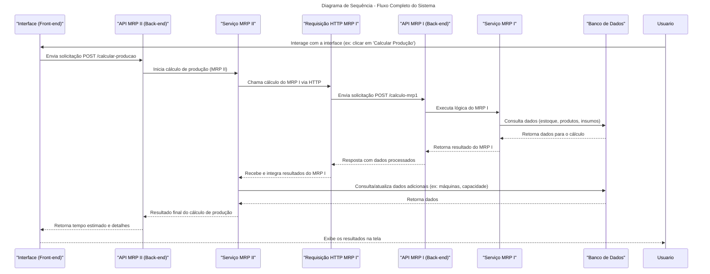

───────── ❖ ─────────

**FLUXO COMPLETO DO SISTEMA**
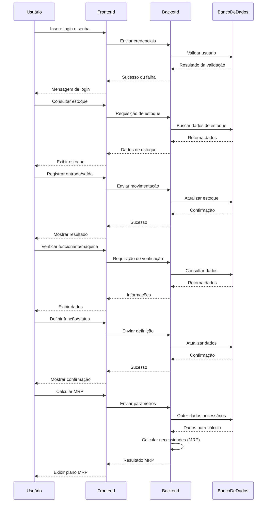

### 5.1.1 Por Requisito Funcional (MRP-I)
**LISTA DE MATERIAIS**
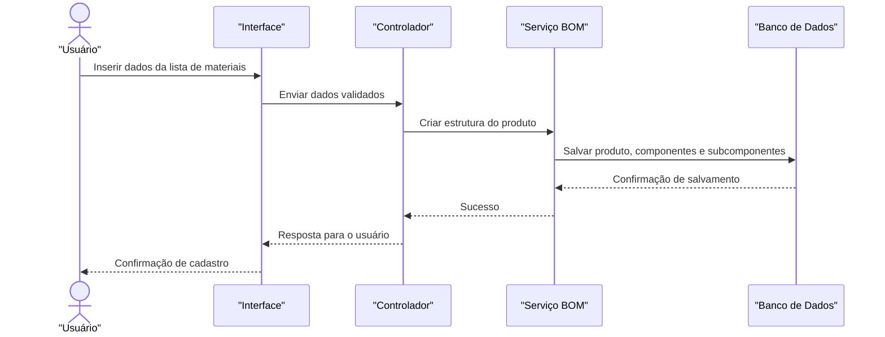

**ATUALIZAÇÃO DE ESTOQUE**
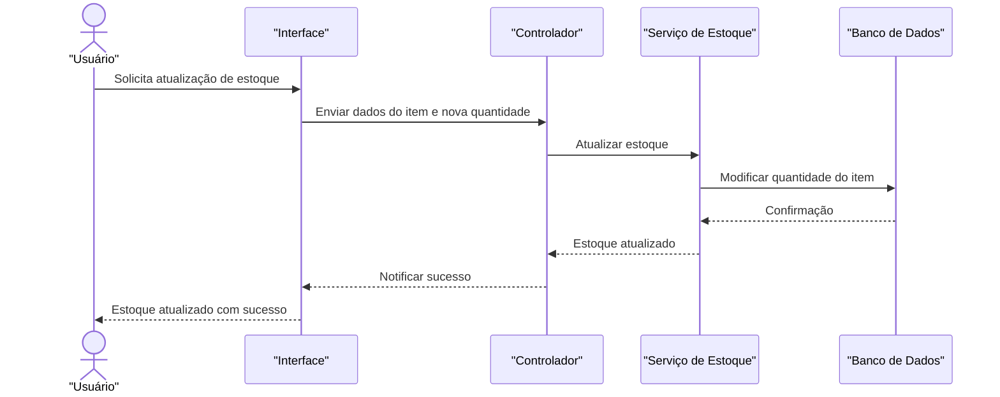

**CONTROLE DE ORDENS**
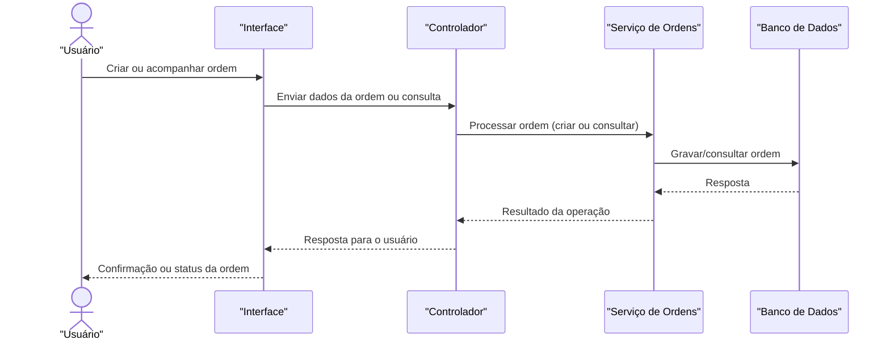

**PREVISÃO DE DEMANDA**
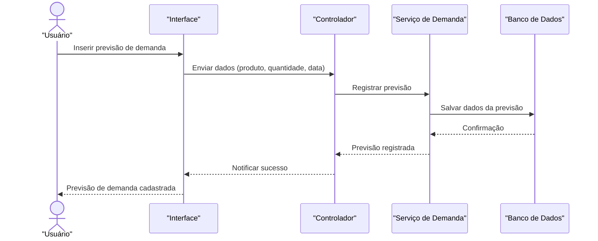

**CRITÉRIOS DE PRIORIZAÇÃO**
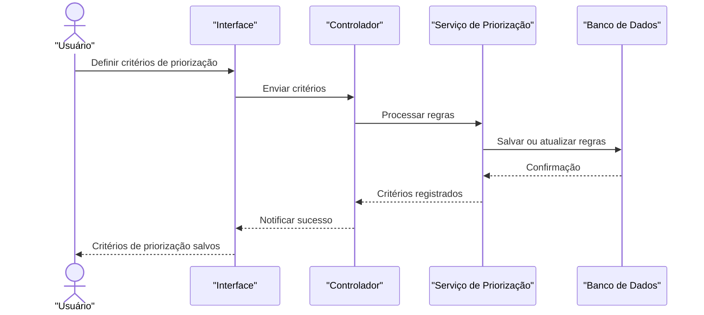

**CALENDÁRIO DE PRODUÇÃO**
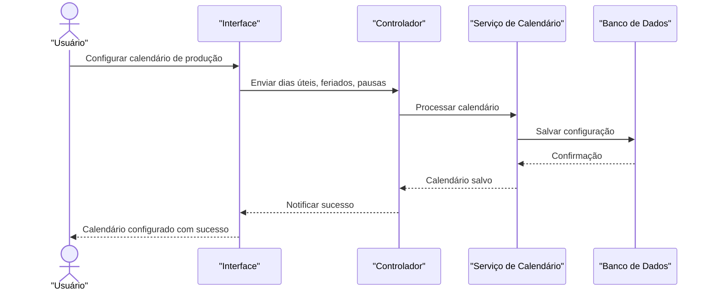

**CADASTRO DE INSUMOS**
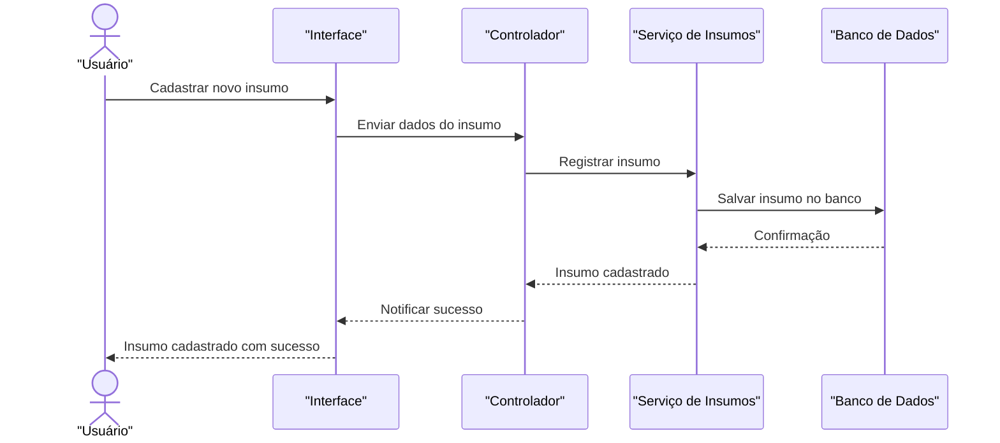

**CADASTRO DE PRODUTOS**
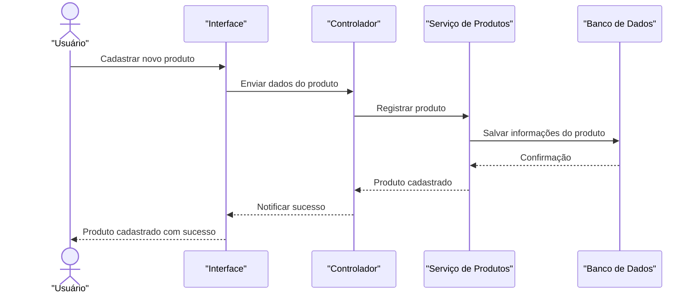

### 5.1.2 Por Requisito Funcional (MRP-II)
**CADASTRO DE MÁQUINAS**
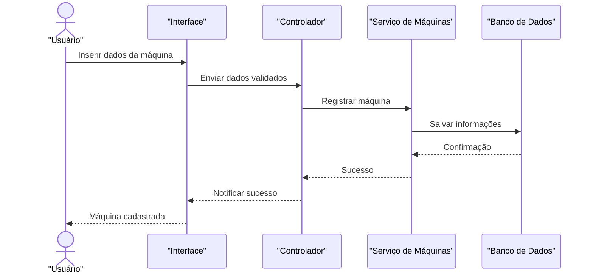

**CADASTRO DE FUNCIONÁRIOS**
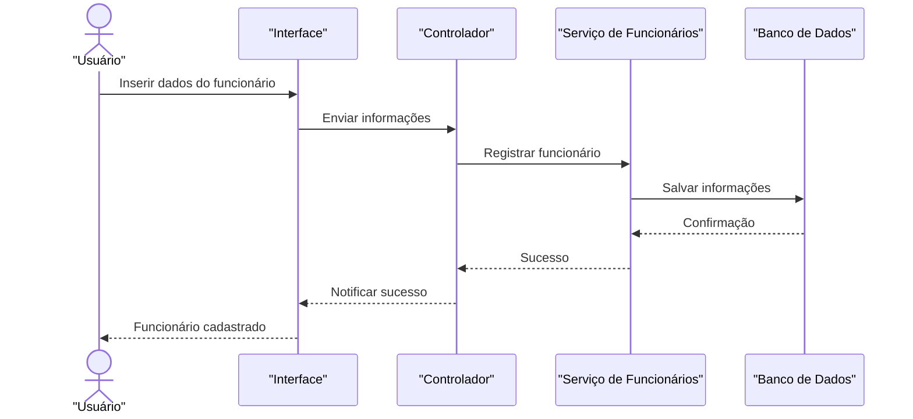

**TEMPO DE MÁQUINA POR PEÇA**
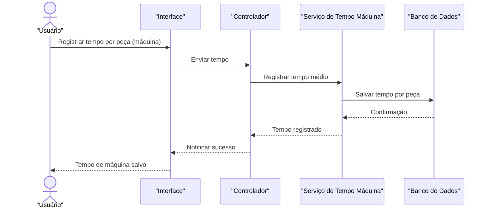

**TEMPO DE FUNCIONÁRIO POR PEÇA**
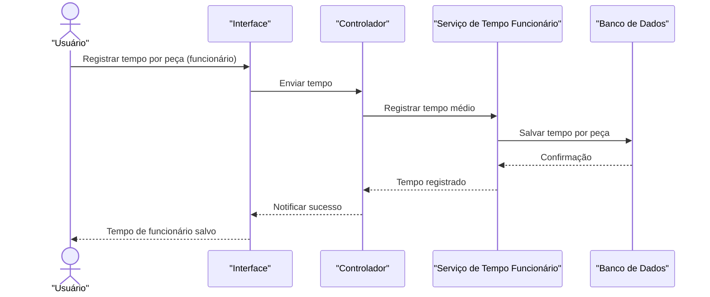

**CONTROLE DE CUSTO DAS MÁQUINAS**
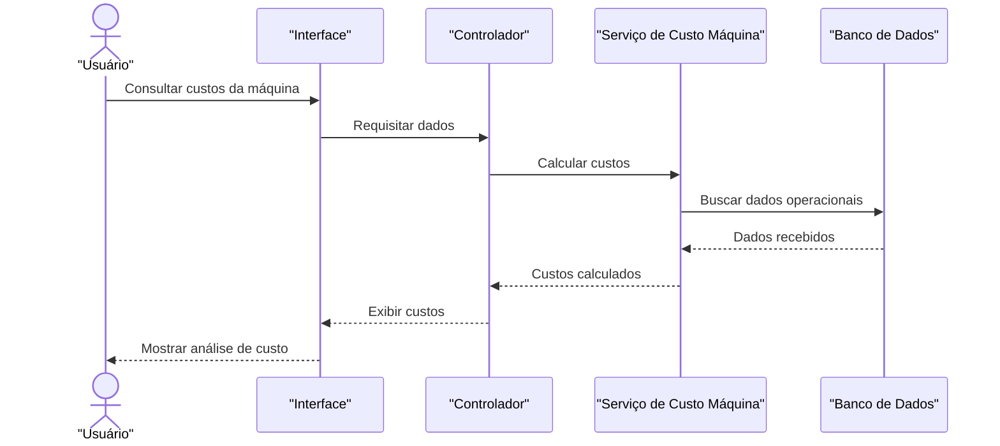

**CONTROLE DE CUSTOS DOS FUNCIONÁRIOS**
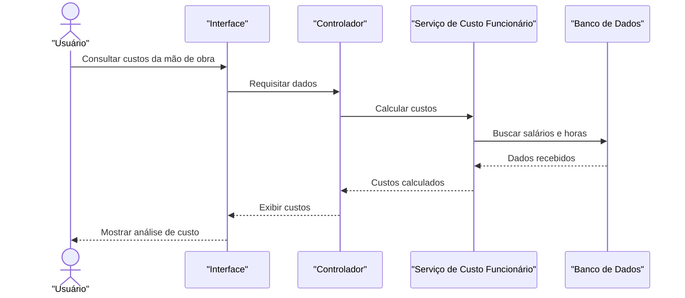

## 5.2 Caso de Uso


### 5.2.1 Por Requisito Funcional (MRP-I)


### 5.2.2 Por Requisito Funcional (MRP-II)
